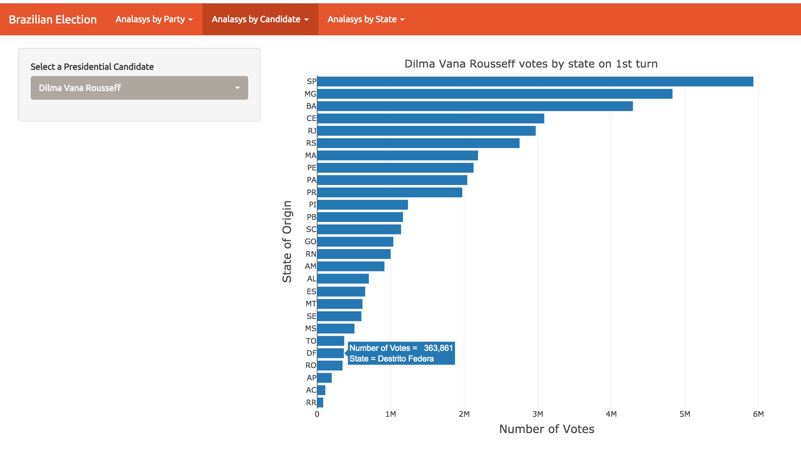
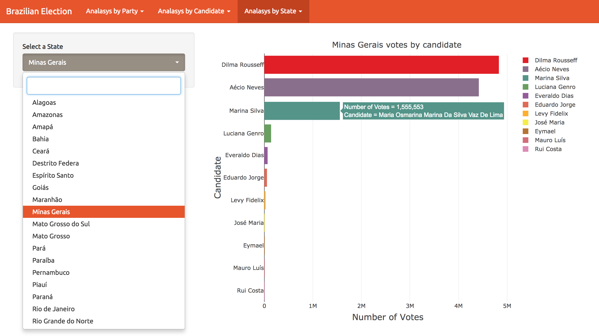
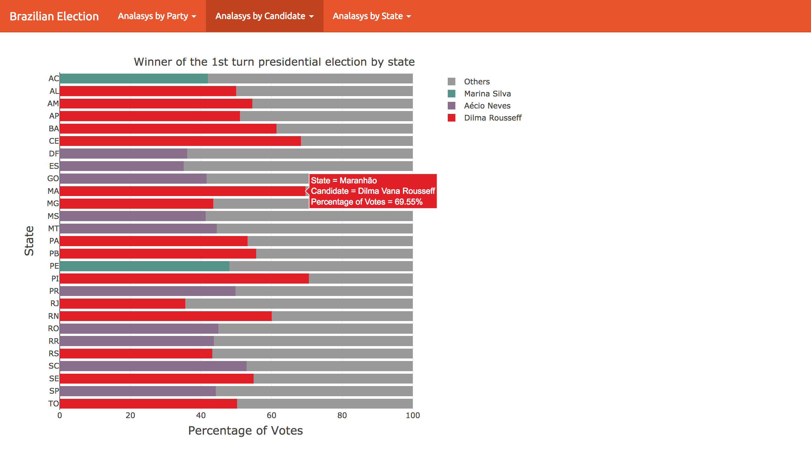
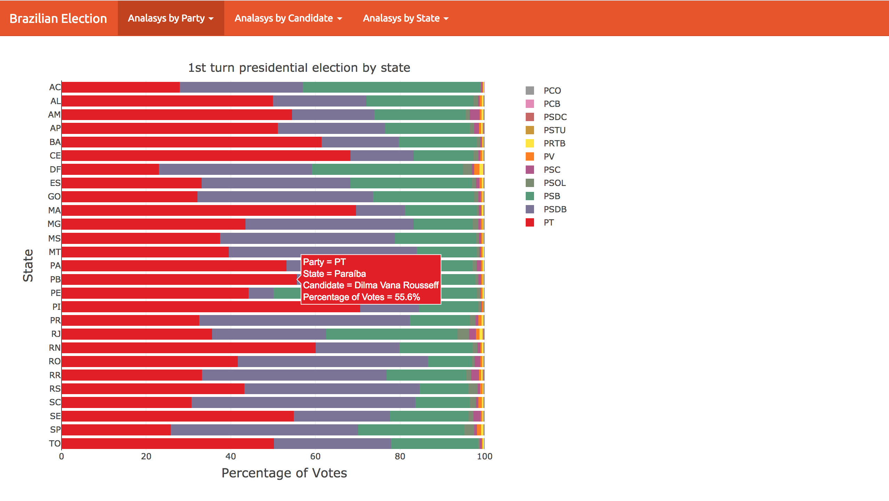

```{r setup, include=FALSE}
knitr::opts_chunk$set(echo = TRUE)
```

## Introdução
Esse é um trabalho desenvolvido para disciplina de visualização de dados do Departamento de Ciência da 

Computação da Universidade Federal de Minas Gerais. Ele tem como objetivo introduzir os alunos a ferramentas e bibliotecas para o desenvolvimento de vi visualizações de dados interativas, bem como explorar a análise visual.

Para atingir esses objetivos foram disponibilizados dados das eleições brasileiras de 2014, retirados do Kaggle. Foi pedido aos alunos que produzissem visualizações que mostrassem pelo menos 2 dos itens da lista abaixo:

* Distribuição dos votos de cada candidato por estado (candidatos à presidência)
* Diferença de votos no primeiro turno e segundo turno (candidatos a presidência)
* Quantidade de votos dos candidatos a um mesmo cargo
* Relacionamentos entre os partidos por meio das coligações
* Porcentagem de vitória de cada partido por estado (candidatos à presidência)
* Partido mais votado por estado

Além disso, foi pedido que os alunos utilizassem os conceitos aprendidos na disciplina e, preferencialmente, uma plataforma de visualizações *D3js*.

## Decisões do projeto
A plataforma escolhida para o desenvolvimento das visualizações de dados não foi a *D3js*, mas sim a biblioteca *plotly* e a linguagem de programação R. A biblioteca *plotly* por sua vez foi criada utilizando-se *D3js* e *stackgl*, sendo apenas um *wrapper* que simplifica e padroniza algumas funcionalidades comuns na criação de visualizações.

Além disso foi decido utilizar a plataforma [shiny](https://shiny.rstudio.com/) como uma forma de criar uma página web para as visualizações para que pudessem ser hospedadas na [shinyapps.io/](shinyapps.io). Dessa forma a página web em que as visualizações desse trabalho estão presentes é [https://paulocirino.shinyapps.io/BrazilianElections/](https://paulocirino.shinyapps.io/BrazilianElections/).

Além disso as perguntas escolhidas para serem respondidas foram :

* Distribuição dos votos de cada candidato por estado (candidatos à presidência)
* Porcentagem de vitória de cada partido por estado (candidatos à presidência)

## Visualizações
### Distribuição dos votos de cada candidato por estado
Essa análise pode ser entendida como duas perguntas diferentes:
- Como foram distribuídos os votos de um candidato em todos os estados
- Como cada estado votou nos diferentes candidatos

Para responder essa pergunta foi utilizado o arquivo *presidente.csv*. E são utilizadas basicamente 3 variáveis, duas qualitativas e uma quantitativa, que são:
- Número de votos (quantitativa)
- Nome do candidato (qualitativa)
- Estado (qualitativa)

É importante ressaltar que *Número de votos* é uma variável do conjunto dos naturais positivos.

A variável *Nome do candidato* pode assumir 11 valores diferentes, que por sua vez é uma quantidade muito grande para ser codificada em um gráfico apenas utilizando cores. Nessa situação as melhores decisões a serem tomadas é fazer com que cada uma das 11 categorias sejam codificadas com posições diferentes ou cada uma tenha seu próprio gráfico. Uma outra alternativa é reduzir o número de categorias representadas em um único gráfico, a maneira mais simples de faze-lo seria agregando os menores valores em uma categoria *'outros'*.

A variável *Estado*, que também é qualidade, é ainda mais difícil de ser trabalhada pois assume 27 possíveis valores, sendo totalmente impossível de ser codificada com sucesso por meio de cores. Dessa maneira se faz necessário a criação de um gráfico por categoria ou a utilização de uma posição diferente para cada categoria. Nessa situação também existe a possibilidade de reduzir o número de categorias, por exemplo utilizando regiões do pais, mas isso não é indicado pois a pergunta a ser respondida pede exatamente que sejam tratados todos os estados.

Por conta dessas considerações, foram desenvolvidas três visualizações para responder essas duas perguntas previamente mencionadas.
 
##### Como foram distribuidos os votos de um candidato em todos os estados
É importante notar que a figura 1 responde a pergunta a pergunta de quantos votos cada candidato recebeu por estado porque mostra quantos votos, em números absolutos, cada candidato recebeu em cada estado. 

Conduto, pelos motivos já mencionadas, não é possível visualizar todos os candidatos ao mesmo tempo. Para solucionar esse problema foi criado um botão em que o usuário pode selecionar um candidato para ser analisado, e então o gráfico atualiza para mostrar suas informações.


É importante notar que foram adicionados título ao gráfico e nome aos eixos. Também foi decido pela utilização das siglas dos estados no eixo *y*, e no eixo *x* as escalas se modificam conforme o máximo de votos de um candidato em um único estado. Foi adicionado um *tooltip* que permite o usuário analisar as informações de forma mais precisa, informando o número exato de votos e o nome do estado.

Foi tomada a decisão de utilizar os números absolutos de votos e não o percentual dos votos de cada estado. Essa é uma decisão que modifica a informação transmitida ao usuário, que no entendido do projetista Tinham o objetivo de mostrar o número real de votos, porque é esse valor que elege um candidato.


##### Como cada estado votou nos diferentes candidatos

O gráfico 02 mostra a mesma informação do anterior, contudo como uma análise diferente.

Essa figura em questão provê um maior enfoque na comparação do desempenho de todos candidatos em cada um dos estados. Para fazer isso o gráfico informa o número de votos, em números absolutos, de cada candidato para um estado que o usuário pode escolher no botão à esquerda do gráfico.

Assim como no gráfico da figura 01, foram adicionados : título, nomes ao eixos, escala do eixo *x* variável conforme o maior valore para número de votos, e abreviações ao nome dos candidatos no eixo *y*. 

Cada candidato é codificado por uma cor diferente e é inserido um *tooltip* com informações mai granulares que as apresentadas no gráfico, como nome completo do candidato e número total de votos.

  
 

A figura 03 tenta condensar as informações dos dois gráficos anteriores em apenas um gráfico. Para fazer isso foi utilizada a estratégia de redução do número de categorias, que nesse caso foi implementada por meio da utilização de apenas um candidato por estado, que é aquele com maior número de votos.

Essa é uma análise que permite ao usuário comparar quais candidatos dominaram mais estados, qual candidatos dominou cada estado e com que margem do total de votos.

Foram utilizados *tootltips* que mostram informações mais detalhadas que as presentes nos eixos e uma codificação de cores diferentes para cada candidato, que é a mesma do gráfico 02.




### Porcentagem de vitória de cada partido por estado

Quando um gráfico mostra porcentagens que somam a um total de 100%, ele é chamado de *partes de um todo*. Esse é exatamente o tipo de informação que é mostrada no gráfico da figura 04, em que as porcentagens de todos os candidatos somadas para um mesmo estado é 100%.

Existem gráficos diferentes para esse tipo de problema, no caso dessa base de dados o objetivo é mostrar uma informação numérica(percentuais) e duas informações categóricas(partidos e estados), por isso foi decidido que seria utilizado o gráfico de *stacked bars*. 

Neste gráfico cada barra horizontal representa 100%, em que o tamanho da barra representa a quantidade em percentual. No eixo *y*, foi codificado cada estado como uma posição e cada partido como uma cor, essa decisão se deu porque existem mais categorias de estados do que categorias de partidos.

Os partidos foram ordenados no eixo *x* por ordem de mais votado para menos votado, considerando o total de votos das eleições. E foram adicionadas informação mais granuladas por meio de *tooltips*.


